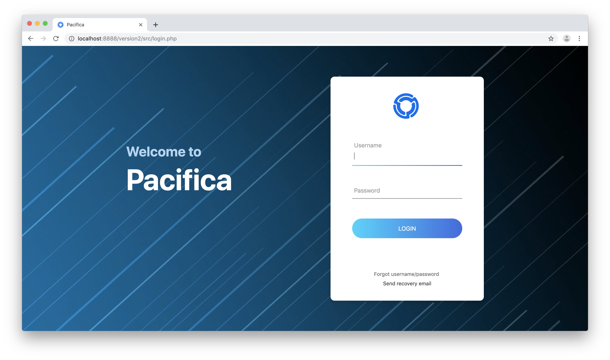

# Pacifica · 
Pacifica is a school library management web app designed to perform basic administrative tasks of a school's library with minimal effort.  

Pacifica was developed using procedural PHP and is intended to be used with a MySQL database. The frontend makes use of jQuery - including AJAX and the libraries DataTables and Bootstrap.  

# What can it do?
Pacifica allows book and student data to be created, read, updated and deleted. Based on this data, it enables librarians to check books in and out of the library.

In a little more detail, it can:

**Create**
1. Book records 
    - Upon scanning the ISBN of a book, Pacifica uses Open Library and Google Books API to fetch the title, author, cover image, description, publisher, published year, page count and categories. Of course, the user can choose to add everything manually as well.
    - CSV batch uploads/downloads are supported.  
  

2. Student records 
    - Pacifica accepts the name, class and roll number of each student.
    - CSV batch uploads/downloads are supported.  

  
**Check in/out books** 

Books can be lent to students and returned to the library in a matter of seconds, either by scanning a book's ISBN or by selecting one manually.  

**Display**
- The front page consists of a clean dashboard showing key numbers at a glace.
- All records are displayed in minimalist tables which provide pagination, multi-column searching and column ordering. Any record can be instantly updated or deleted from the same page as well.
- Check in/out records are stored in the History table.
- Overdue books are listed once again in a separate page.

**Control**  

Pacifica has two types of users:
1. Admins - they are granted the ability to create, update and delete all data.
2. Users - they are able to view book data and book data only.   

Both kinds of users are required to log in to access any page.  

# Why did I make this?  
Pacifica was originally developed as a possible solution for my high school's uncataloged library. Today, it's a fun side project that I enjoy building upon!
